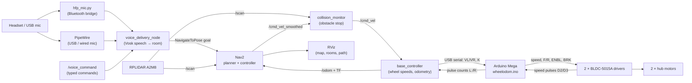
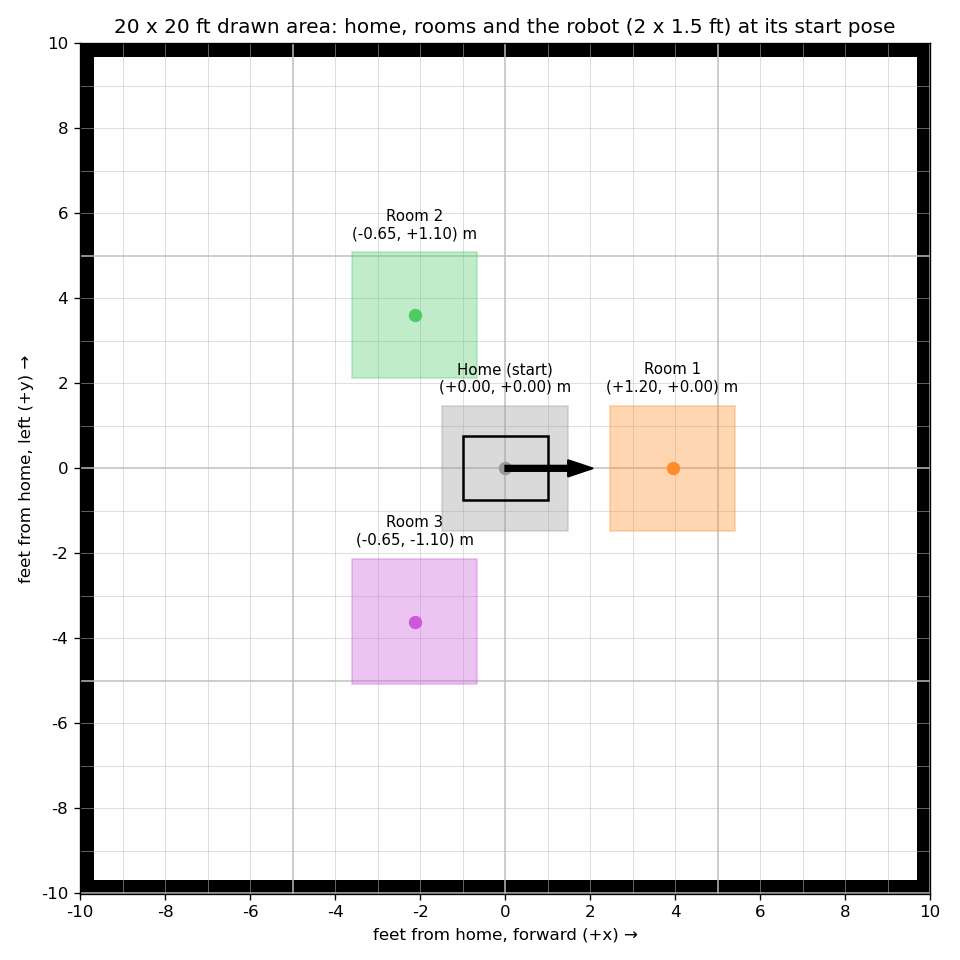

# Hospital Delivery Robot — Handover

This document is everything needed to wire, set up, run, calibrate, change and debug the robot. It describes the version on branch **`floor-tested-v1`** (October 2026), which was tested on a 20 × 20 ft open floor.

- Repository: <https://github.com/VEER19Hiremath/HUMANOID-BOT>
- Quick reference and fix history: [`README.md`](../README.md)

---

## Contents

1. [What the robot does](#1-what-the-robot-does)
2. [How it fits together](#2-how-it-fits-together)
3. [Hardware](#3-hardware)
4. [Wiring, with cable colours](#4-wiring-with-cable-colours)
5. [Setting up a computer](#5-setting-up-a-computer)
6. [Running the robot](#6-running-the-robot)
7. [The map and the rooms (RViz)](#7-the-map-and-the-rooms-rviz)
8. [Calibration](#8-calibration)
9. [The code, file by file](#9-the-code-file-by-file)
10. [Tests and test tools](#10-tests-and-test-tools)
11. [Troubleshooting](#11-troubleshooting)
12. [Known limits and next steps](#12-known-limits-and-next-steps)

---

## 1. What the robot does

You say a room ("go to room two") into a Bluetooth headset or a USB microphone. The robot plans a route and drives there on its two hub-motor wheels. It stops at once when you say **"stop"**.

On the way, it stops for people and objects the lidar sees, drives around them when there is room, and waits for them to move when there isn't.

What works (tested on the floor):

- **Voice.** Room commands; "go home"; instant "stop"; redirecting to a new room mid-trip; noise and half-heard phrases are ignored.
- **Driving.** Closed-loop wheel speeds, synchronised wheels, measured odometry, forward-only arcs, stall protection.
- **Navigation.** Rooms 1–3 and home on a 20 × 20 ft map, about 1.2–1.3 m from the centre.
- **Obstacles.** Detour at a safe distance, or wait and continue.

Limits are listed in [section 12](#12-known-limits-and-next-steps). The most important: the robot knows its position **only from its wheels**. On an empty floor the lidar has nothing to localise against, so expect about ±10–25 cm at a room.

---

## 2. How it fits together



In words:

1. **Speech to goal.** `voice_delivery_node` turns a recognised phrase into a room. It sends Nav2 a goal at that room's position, taken from the map file.
2. **Planning.** Nav2's planner (Smac Hybrid-A\*, forward-only) plans a route made of arcs the robot can actually drive.
3. **Following.** The controller (Regulated Pure Pursuit) follows that route and outputs a body speed and turn rate.
4. **Safety gate.** The collision monitor passes those commands on, or replaces them with a stop or a slowdown when the lidar sees something close ahead.
5. **Wheel speeds.** `base_controller` turns body speed and turn rate into left and right wheel speeds. It sends them to the Mega 50 times a second.
6. **Motor control.** The Mega runs a speed controller for each wheel. It sets each driver's speed input (PWM), direction, enable and brake, using the wheel-speed pulses from the drivers.
7. **Odometry.** The Mega reports pulse counts every 50 ms. `base_controller` turns them into the robot's position (`/odom` and the `odom → base_footprint` transform).
8. **Map frame.** With the drawn map, `map → odom` is fixed at the start spot ("home"). The robot's position is therefore pure wheel odometry from where it was started.

---

## 3. Hardware

| Part | Notes |
|---|---|
| Raspberry Pi (Ubuntu 24.04, ROS 2 Jazzy) | Runs everything except motor control |
| Arduino Mega 2560 | USB to the Pi; motor drivers and wheel-speed feedback |
| 2 × BLDC-5015A motor drivers | Left and right; powered from the motor battery on **DC+ / DC−** |
| 2 × brushless 6-inch hub motors | Three phase wires and a Hall-sensor plug into each driver |
| RPLIDAR A2M8 | USB; 360° at 10 Hz, range 12 m |
| Bluetooth headset or USB microphone | Voice input; any paired hands-free headset works |
| Motor battery (24–50 V) | Drivers only, with one fuse per driver |
| Robot body | **2 ft × 1.5 ft** (0.61 × 0.46 m), centred on the wheel axle; wheels 0.43 m apart |

Driver switches, the same on **both** drivers:

| Setting | Position |
|---|---|
| **SW2** | **OFF**: speed comes from the Mega (AVI input), not the knob |
| **SW1** | Leave as it is |
| Round knob **RV** | Fully **anticlockwise** |

Driver manual: [BLDC-5015A](https://www.ht-gear.com/uploads/BLDC5015-EN.pdf).

---

## 4. Wiring, with cable colours

> **Do all control wiring with the motor battery disconnected. Connect the battery last.** Never power the drivers from the Mega's 5 V.

### 4.1 Battery → drivers

| Battery | Left driver | Right driver |
|---|---|---|
| + (24–50 V), through a fuse | **DC+** | **DC+** |
| − | **DC−** | **DC−** |

Check polarity twice.

### 4.2 Motor → driver (each side)

| Motor cable | Driver terminal |
|---|---|
| Three thick phase wires | **U, V, W**: keep the original order. Do **not** swap them to change direction; the Mega's F/R line does that. |
| Small Hall-sensor plug | Hall socket (REF+, REF−, HU, HV, HW), pushed fully in |

### 4.3 Driver control cable → Mega

| Cable colour | Driver signal | **Left** → Mega | **Right** → Mega | What it does |
|---|---|---|---|---|
| 🟣 **Purple** | AVI | **D10** | **D9** | Speed (PWM). The two purple wires are **crossed** on this harness: the left driver is on D10, the right on D9. |
| 🟡 **Yellow** | F/R | **D52** | **D53** | Direction |
| 🔴 **Red** | ENBL | **D22** | **D23** | Run / stop (HIGH = run) |
| 🔵 **Blue** | BRK | **D30** | **D31** | Brake (LOW = released) |
| ⚫ **Black** | COM / GND | **GND** | **GND** | Signal ground, shared by both drivers |

By pin, for a quick check:

| Mega pin | Goes to |
|---|---|
| D2 | Left speed pulse (through 1 kΩ) |
| D3 | Right speed pulse (through 1 kΩ) |
| D9 | Right AVI (purple) |
| D10 | Left AVI (purple) |
| D22 / D23 | Left / right ENBL (red) |
| D30 / D31 | Left / right BRK (blue) |
| D52 / D53 | Left / right F/R (yellow) |
| GND | Both driver commons (black) |

> **Yellow is direction, blue is brake.** With them the other way round, each wheel ran in one direction only and stalled in the other: red driver LED, blown fuses. **Purple must only ever go to D9 / D10.** A speed wire on a direction or brake pin can make a wheel run away.

### 4.4 Wheel-speed feedback → Mega

| Wire | From | Left | Right |
|---|---|---|---|
| Speed pulse | Driver speed output | **D2** through **1 kΩ** | **D3** through **1 kΩ** |

- No 5 V goes on these wires: the Mega's internal pull-up reads them, and the black wire provides the shared ground.
- The drivers give about **12–13 pulses per wheel turn**, which is **36 mm of travel per pulse**.
- Keep these wires away from the motor phase wires. The **right** signal picks up false pulses (see [section 12](#12-known-limits-and-next-steps)).

### 4.5 USB

| Device | Port |
|---|---|
| Arduino Mega | `/dev/serial/by-id/usb-Arduino*` (found automatically) |
| RPLIDAR | `/dev/serial/by-id/usb-Silicon_Labs*` (found automatically) |

Use separate USB ports. Motor noise can disconnect the Mega; if so, power off, then reseat it on another port.

### 4.6 Power-up order and healthy lights

1. Mega USB to the Pi. It prints `SAFE START READY` and the wheels stay still.
2. Control and speed wires connected.
3. Driver LEDs are **off** at idle.
4. Motor battery **on**.
5. `./start.sh`.

**A red driver LED means the driver has latched a fault.** Turn the battery **off, wait 10 s, turn it on again**.

---

## 5. Setting up a computer

On a fresh Raspberry Pi with Ubuntu 24.04:

```bash
git clone https://github.com/VEER19Hiremath/HUMANOID-BOT.git ~/Desktop/veeresh
cd ~/Desktop/veeresh
git checkout floor-tested-v1
./setup.sh --test          # install everything, build, run the unit tests
./setup.sh --flash         # with the Mega plugged in: put the firmware on it
```

[`setup.sh`](../setup.sh) does the following (each step is skipped if already done):

| Step | What |
|---|---|
| 1 | ROS 2 Jazzy (if missing) and the ROS packages the robot uses: Nav2, the Smac planner, collision monitor, slam_toolbox, robot_state_publisher, teleop, RViz |
| 2 | System packages: pyserial, numpy, scipy, matplotlib; PipeWire, ALSA, BlueZ and the SBC codec (headset audio) |
| 3 | `~/venv` with the speech packages from [`requirements.txt`](../requirements.txt) (Vosk) |
| 4 | The Vosk speech model in `~/models/vosk-model-small-en-us-0.15` |
| 5 | `arduino-cli` and the AVR core in `.tools/` (used to flash the Mega) |
| 6 | Adds you to the `dialout` group for serial-port access. Log out and back in once afterwards. |
| 7 | `colcon build` of the workspace |

### Headset (once per headset)

```bash
bluetoothctl
  scan on              # put the headset in pairing mode; note its address
  pair  XX:XX:XX:XX:XX:XX
  trust XX:XX:XX:XX:XX:XX
  connect XX:XX:XX:XX:XX:XX
  exit
```

After pairing once, the robot picks the headset up by itself. It takes the connected headset first, then tries every paired hands-free headset. A USB microphone also works, with nothing to configure.

**Headsets connect to one device at a time.** Turn off Bluetooth on your phone before starting the robot.

---

## 6. Running the robot

### Start

1. Put the robot **in the middle of the area**, facing the direction you want "forward" (room1 is straight ahead).
2. Battery on.
3. Run:

```bash
cd ~/Desktop/veeresh
./start.sh
```

Wait about 2 minutes for this:

```text
Mega: OK
Lidar:          OK  (10 scans/s)
Odometry:       OK  (20 msgs/s)
Localization:   OK  (map frame published)
Map:            OK  (received)
Obstacle stop:  OK  (active)
Lidar view:     NOTE (… % of beams return …)   ← normal on an open floor
Ready: say 'go to room one' (rooms of the map: see docs/room_map.png), 'go home' or 'stop'.
```

If a check says PROBLEM, `start.sh` restarts everything once by itself. If it still fails: `./start.sh stop`, then `./start.sh` again.

**The spot where you start is "home".** The robot's position is measured from there, so always start at the same place, facing the same way.

### Voice commands

| Say | Robot |
|---|---|
| "go to room one" / "room one" / "go to one" | Drives to room1 (same pattern for two and three) |
| "go home" / "go to home" / "reception" | Drives back to the start spot |
| "stop" | Stops at once and cancels the trip |
| A new room during a trip | Changes destination |

- Speak close to the mic, and use full phrases.
- A bare "one" or "home" is ignored on purpose: background noise produces those.
- Unsure recognitions are logged as `Ignoring unsure phrase …` and do nothing.
- The Pi has no speaker, so the robot doesn't talk back. Its replies ("Going to room 2", "Arrived") appear in the voice log. Plug in a speaker and they're spoken, if Google TTS is installed.

**Typed commands** go through exactly the same path as speech:

```bash
source /opt/ros/jazzy/setup.bash
ros2 topic pub --once /voice_command std_msgs/String "data: go to room two"
```

### Obstacles

| Situation | Behaviour |
|---|---|
| Something 0.70–1.10 m ahead | Slows to 70 % |
| Something 0.32–0.70 m ahead (0.32–0.65 m behind when reversing) | Stops |
| A way round exists | Replans around it, keeping a safe distance (0.6 m inflation), and continues |
| No way round | Waits; tries again every few seconds for about 2–3 minutes, then gives up ("Could not reach") |
| Obstacle goes away | Continues to the room by itself |

### Stop and logs

```bash
./start.sh stop           # stop everything
./start.sh status         # what is running
```

**Emergency stop:** say "stop", or switch the motor battery off.

Every start writes a new log folder: `run_logs/<date>_<time>_start/`. `run_logs/latest` always points at the newest; the last 30 runs are kept.

| Log | Contains |
|---|---|
| `voice.log` | What was heard, what was ignored and why, goals sent, arrivals |
| `nav.log` | Nav2: plans, obstacle stops, failures |
| `base.log` | Mega status every second (effort, pulses, measured and target speed), stalls; lidar driver |
| `hfp.log` | Bluetooth headset bridge |
| `map.log` | Map server |

---

## 7. The map and the rooms (RViz)



The current map is **`maps/open_floor.yaml`**: a 20 × 20 ft empty square, with home in the middle.

| Room | Position (x forward, y left), from home | Where |
|---|---|---|
| home | (0, 0) | Start spot, facing +x |
| room1 | (1.20, 0.00) m, about 4 ft | Straight ahead |
| room2 | (−0.65, +1.10) m | Behind, left |
| room3 | (−0.65, −1.10) m | Behind, right |

**What RViz shows** (it opens with `./start.sh`):

- the map;
- coloured **room zones with names** (the room being driven to is highlighted);
- the **planned path** in green;
- the **obstacle-stop zone** in red;
- lidar points;
- the robot model.

**Why the rooms are so close in.** The robot drives forward only, and turns with a radius of at least 0.5 m. To turn round it needs about 1.5 m of floor beyond a room. Rooms further out sent the robot within 0.5 m of an edge, where it got stuck.

### Changing the rooms or the area

1. Edit `MAPS['open_floor']` in [`scripts/make_area_map.py`](../scripts/make_area_map.py): `size_ft` and `rooms` (in metres, x forward, y left).
2. Regenerate the map, the picture, and check every trip without driving:

```bash
python3 scripts/make_area_map.py open_floor     # writes maps/open_floor.pgm/.yaml
python3 scripts/render_map.py                   # writes docs/room_map.png
./start.sh                                      # then, in another terminal:
python3 scripts/plan_check.py                   # plans every room pair (no driving)
```

`plan_check.py` must report `0 problem path(s)`. Each path's `wall gap` should be 0.4 m or more.

The rooms live **in the map file** as `# room: name x y` lines. The voice node and RViz both read them from there. `room_config.py` only holds the spoken names and a fallback.

### Scanning a real room instead (optional)

In a room with walls and furniture, a scanned map lets the lidar correct the position continuously. That is more accurate than wheel odometry alone.

```bash
./start.sh map
```

Drive slowly along every wall with the keyboard. The map auto-saves every 30 s. Press Ctrl+C when done, then click the rooms in RViz when asked.

`start.sh` then uses `maps/floor_map.yaml` with lidar localisation (AMCL). This is **not useful on an empty floor**: there is nothing for the lidar to see.

---

## 8. Calibration

### Wheel distance (do it after changing a wheel, driver or wiring)

The robot's sense of distance comes from `src/hospital_bringup/config/odometry.yaml`:

```yaml
distance_per_pulse: 0.0360        # metres per LEFT wheel pulse
right_encoder_multiplier: 0.92    # right pulse length / left
```

To re-measure:

1. `./start.sh`, with about 2 m clear ahead.
2. In a second terminal, run `./start.sh calibrate`.
3. Tape the floor at both wheel hubs and press Enter. The robot drives 1.5 m (by its own count).
4. Tape the hubs again. Type how far the midpoint moved **forward** and **sideways** (cm, left is +).
5. It writes the new values. Run `./start.sh stop; ./start.sh`.

By hand instead: drive 1 m by its count, measure **each wheel's** travel, and set:

- `distance_per_pulse = (left wheel cm / 100) / left pulses`;
- `right_encoder_multiplier = (right cm / left cm) × (left pulses / right pulses)`.

The pulse counts are in `base.log` (`L=… R=…`).

### Wheel direction (after any motor or driver rewiring)

```bash
./start.sh stop
python3 scripts/wheel_direction_test.py     # each wheel alone at its forward level (read from the firmware), 3 s
```

**Each wheel must roll forward.** If one rolls backward, flip `LEFT_INVERTED` or `RIGHT_INVERTED` in `arduino/wheelodom.ino` and reflash (`./setup.sh --flash`).

Current, verified setting: `LEFT_INVERTED true`, `RIGHT_INVERTED false`. A straight run from rest must go straight.

---

## 9. The code, file by file

### 9.1 Overview

| Path | Language | Role |
|---|---|---|
| `arduino/wheelodom.ino` | Arduino C++ | Motor control on the Mega |
| `arduino/test/` | C++ | Host tests for the firmware (simulated wheels) |
| `src/wheel_odometry/` | Python (ROS 2) | `base_controller`: Mega link, wheel speeds, odometry |
| `src/hospital_delivery/` | Python (ROS 2) | Voice control, rooms, RViz room markers, RViz config |
| `src/hospital_bringup/` | Launch / YAML | Starting everything, Nav2 settings, odometry calibration, behaviour tree |
| `src/hospital_description/` | URDF | Robot model (frames: base_footprint, base_link, laser, wheels) |
| `src/rplidar_ros/` | C++ | Lidar driver (vendor package, with startup fallbacks added) |
| `src/hospital_world/`, `src/sllidar_ros2/` | | Simulation world and a spare lidar driver. **Not used** on the real robot. |
| `maps/` | | `open_floor` (current), `area_30x40` (old drawn area); a scan becomes `floor_map` |
| `scripts/` | Python | Setup helpers, calibration, tests, map tools |
| `start.sh`, `setup.sh` | Bash | Run the robot / install everything |

### 9.2 `arduino/wheelodom.ino`: motor control on the Mega

Runs on its own, independent of ROS. If the Pi stops talking for 300 ms, the motors stop.

**Serial protocol (115200 baud):**

| Pi → Mega | Meaning |
|---|---|
| `VL:<m/s> VR:<m/s>` | Wheel speeds. Must repeat within 300 ms. |
| `K:<left> <right>` | Metres per pulse for each wheel. Sent by `base_controller` at connect. |
| `PINS …` / `PINS OFF` | Bench mode: raw pin levels on one wheel. Stops by itself 1.5 s after the last command. |

| Mega → Pi | Meaning |
|---|---|
| `SAFE START READY` | Booted, motors off |
| `L:<count> R:<count>` | Signed pulse counts, every 50 ms |
| `S: pwmL=… pwmR=… … spL=… spR=… tgL=… tgR=…` | While driving: effort, measured (`sp`) and target (`tg`) wheel speed in pulses/s |
| `STALL HARD STOP` | A driven wheel stopped turning; both cut for 10 s |
| `K OK <l> <r>` | Pulse sizes accepted |

**How it drives a wheel** (`controlWheel()`, every 20 ms):

- **Speed measurement.** Each speed pulse fires an interrupt (`countPulse`). The interrupt counts the pulse (signed: + forward, − reverse) and records the time since the previous pulse. Speed is 1 / pulse interval. Pulses closer than 5 ms are ignored as noise. Only rising edges are counted, because the right wheel's falling edges carry false pulses.
- **PI speed controller.**
  - Feed-forward from a measured effort curve, plus proportional and integral terms on the speed error (`KP 0.25`, `KI 1.0`).
  - A wheel with more drag automatically gets more effort.
  - Effort is clamped to **6–32**. **32 is the fuse cap**: never raise it; higher stall currents blew fuses.
- **Start push.** Until a wheel's first pulse (up to 0.6 s), its effort is at least **24**, to break floor friction.
- **Stuck-wheel kick.** If a driving wheel misses its pulses (1.5 expected intervals, at least 0.3 s), it gets effort 24 for up to 0.4 s.
- **Wheel synchronisation** (`synchronise()`).
  - While both wheels drive the same way, the real distance each has covered since the command changed must keep the commanded ratio (1 on a straight line).
  - The behind wheel is sped up and the other slowed, by up to 0.03 m/s.
  - In simulation, a wheel at its power limit ended 1 count from the other with sync, 21 without.
- **Direction change.** The wheel coasts down (up to 1.5 s), then its driver is **switched off**, the F/R line is set, and the driver is switched on again 0.3 s later. The left driver doesn't reliably follow a direction change while enabled.
- **Stall cut** (`wheelFrozen()`, fuse protection).
  - Trigger: a driven wheel with effort ≥ 12 and no pulse for 3 expected intervals (at least 0.5 s), after a 1 s start-up grace for that wheel.
  - Action: **both** wheels stop for 10 s, then the Mega retries as a fresh start.
- **Safety rules.**
  - The wheels are never driven in opposite directions.
  - A one-wheel command becomes an arc (the other wheel at 45 %).
  - No command for 300 ms means motors off.
  - The brakes are always released (stopping is a coast).

**Key settings at the top of the file:**

- pin numbers;
- `LEFT_INVERTED` / `RIGHT_INVERTED` (direction polarity);
- `PWM_MAX` (fuse cap);
- the speed-control gains;
- stall timings.

**Flash:** `./setup.sh --flash` (stop the robot first: `./start.sh stop`).

**Tests:** `arduino/test/run_tests.sh` compiles the sketch against a mock Arduino (`Arduino.h`). It runs 42 tests (`test_firmware.cpp`) with simulated wheels that have load, lag, friction, jams and noise: speed tracking, drag compensation, arcs, sync, reversals, re-key, stalls, kicks, timeouts, bench mode, the pin map.

### 9.3 `src/wheel_odometry/wheel_odometry/base_controller.py`: Mega link and odometry

A ROS 2 node, started by `real_robot.launch.py`:

- **`/cmd_vel` → wheel speeds** (`wheel_speeds()`).
  - Turn rate is limited so the inner wheel keeps at least ~36 % of the outer (radius ≥ 0.46 m).
  - Turning on the spot becomes a forward arc at 0.08 m/s.
  - Wheel speeds are capped at **0.15 m/s**, keeping the left/right ratio.
  - The wheels are never driven in opposite directions.
- **Easing** (`ease()`). Wheel speeds change at 0.10 m/s² up and 0.30 m/s² down.
- **Serial link.**
  - Opens the Mega without resetting it (DTR held low).
  - Waits for it to boot, then sends `K:` (pulse sizes from `odometry.yaml`).
  - Sends `VL/VR` at 50 Hz.
  - Reconnects by itself if the USB drops, and re-sends `K:` if the Mega restarts.
- **Odometry** (`_on_counts()`, `integrate()`).
  - Signed counts × metres per pulse give each wheel's distance.
  - The exact arc update gives the new pose.
  - Published as `/odom` and the `odom → base_footprint` transform, with measured speed.
  - No guessing between reports.
- **Logs.** The Mega status line once a second; stall messages.

Parameters (from `src/hospital_bringup/config/odometry.yaml` and the launch file): `arduino_port`, `wheel_base` (0.4318 m), `distance_per_pulse`, `right_encoder_multiplier`.

Tests: `src/wheel_odometry/test/test_base_controller_math.py` (9 tests: arc limits, no opposite wheels, easing, arc odometry).

`teleop_keyboard.py` is a simple keyboard driver. `./start.sh map` uses the standard `teleop_twist_keyboard` instead.

### 9.4 `src/hospital_delivery/hospital_delivery/voice_delivery_node.py`: voice control

**Microphone** (`_listen_loop()`):

- **Bluetooth headset.** Audio comes from `scripts/hfp_mic.py` through `/tmp/hospital_hfp_mic.sock`. It's used while the bridge reports audio flowing (`/tmp/hospital_hfp_mic.up`).
- **Otherwise the system microphone** through PipeWire (`arecord`). Switches automatically both ways.
- If audio falls more than 1 s behind (busy Pi), old audio is dropped, so "stop" is never late.

**Speech gate** (`_consume_audio()`):

- Only audio above the room's noise floor is fed to the recognizer.
- **0.5 s before** speech starts and **0.8 s after** it drops are fed too, so a phrase's soft start and its pauses aren't cut.

**Recognizer** (`_new_recognizer()`):

- Vosk, limited to the command phrases of the rooms on the loaded map (`ROOM_ALIASES`).
- Reports per-word confidence.

**Accepting a command** (`_queue_command()`, `_handle_command()`):

- **"stop"** acts on the first partial guess; a false stop is harmless. It cancels **all** Nav2 goals through the action's cancel service (`stop_robot()`), even if the goal handle was lost, and publishes zero speed.
- **Room commands** need a **finished** phrase. Every word must have confidence **≥ 0.4** (parameter `min_confidence`), and the phrase must be complete ("room one", "go to room one", "go home"; not a bare "one" or "home").
- Phrases with unrecognised sound (`[unk]`) are ignored, unless "room \<n\>" or "go home" was heard clearly.
- The same phrase within 3 s is ignored.

**Goal** (`navigate_to_room()`):

- Position comes from the map file's `# room:` lines.
- Heading is the bearing from the robot's current position, so it arrives driving straight in.
- A new goal replaces the old one (Nav2 preempts).
- `_on_nav_result()` logs "Arrived at …", "ABORTED" or "cancelled".

**Other details:**

- `/voice_command` (`std_msgs/String`) feeds typed text into the same path.
- Speech output uses Google TTS, then espeak, if installed.

Parameters: `map_yaml` (set by `start.sh`), `min_confidence` (0.4), `mic_watchdog_s` (0 = off).

### 9.5 Other `hospital_delivery` files

| File | What it does |
|---|---|
| `room_config.py` | `ROOM_ALIASES`: the spoken forms of each room. `rooms_from_map()`: reads `# room:` lines. `goal_yaw()`: heading towards a room. `room_heading()`: alternative "face the centre" heading, currently unused. `ROOM_COORDS`: fallback rooms. |
| `room_markers.py` | Publishes `/room_markers` for RViz: a zone, pin and name per room; highlights the room at the end of the planned path. |
| `rviz/hospital_nav.rviz` | RViz layout: map, scan, robot model, TF, rooms, planned path, stop zone |

### 9.6 `scripts/hfp_mic.py`: Bluetooth headset bridge

Acts as the "phone" (hands-free audio gateway) for any paired headset. PipeWire's own handling made headsets drop the call link before any audio flowed.

- Picks the connected hands-free headset, or tries each paired one; the last one that worked goes first (`~/.hospital_headset`).
- Opens the control link (RFCOMM) and answers the headset's AT commands.
- Opens the audio link (SCO) with **mSBC** (wideband, decoded with libsbc) or **CVSD** (narrowband).
- Publishes 16 kHz audio on the socket, and creates `/tmp/hospital_hfp_mic.up` while audio flows.

### 9.7 `src/hospital_bringup/`: launch files and settings

| File | What it does |
|---|---|
| `launch/real_robot.launch.py` | Robot model (robot_state_publisher), fixed `map → odom` at home (drawn maps), `base_controller` with `odometry.yaml`, lidar driver |
| `launch/localization.launch.py` | Map server, plus AMCL for scanned maps |
| `launch/navigation.launch.py` | All Nav2 servers in **one** process (`component_container_isolated`), managed by a lifecycle manager. Separate processes hung at startup on this Pi. |
| `launch/full_system.launch.py` | Old combined launch, **not used** |
| `config/odometry.yaml` | Wheel calibration ([section 8](#8-calibration)) |
| `config/nav2_params.yaml` | All Nav2 settings, summarised below |
| `config/slam_params.yaml` | slam_toolbox settings for `./start.sh map` |
| `behavior_trees/navigate_to_pose.xml` | Plan → follow → on failure: clear costmaps / wait, retry (30 times, ~2–3 min). Replans every 3 s. No back-up or spin recovery. |

**`nav2_params.yaml`, the important settings:**

| Section | Setting | Value | Why |
|---|---|---|---|
| `planner_server` | `SmacPlannerHybrid`, `DUBIN` | Forward-only arcs | Reversing changes wheel direction, which the left driver doesn't reliably follow |
| | `minimum_turning_radius` | 0.50 m | `base_controller` allows ~0.46 m |
| `controller_server` | RPP `desired_linear_vel` | 0.15 m/s | Real speed (calibrated) |
| | `allow_reversing` | false | Forward-only |
| | `xy_goal_tolerance` | 0.25 m | Tighter tolerances made the robot loop round for another try |
| | `failure_tolerance` | 3 s | Brief blockage doesn't abort |
| | `use_collision_detection` | true | Won't drive a path into an obstacle |
| `velocity_smoother` | `min_velocity` | 0 | Navigation never reverses |
| Both costmaps | `footprint` | ±0.31 × ±0.23 m | The 2 × 1.5 ft body |
| | `inflation_radius` | 0.60 m | Safe distance from walls and obstacles |
| | `obstacle_layer` | lidar, `inf_is_valid: true` | Detours around live obstacles; marks clear when they leave |
| `collision_monitor` | `PolygonStop` | 0.32–0.70 m ahead / 0.32–0.65 m behind | Hard stop |
| | `PolygonSlow` | 0.70–1.10 m ahead, ×0.7 | Slowdown |
| | `base_shift_correction` | false | Late TF on a busy Pi made it stop for "invalid source" |

### 9.8 `start.sh`

| Command | What it does |
|---|---|
| `./start.sh` | Stops leftovers. Starts the robot (base, lidar, map, Nav2, RViz, headset bridge, voice, room markers). Checks health and restarts once if needed. |
| `./start.sh stop` | Stops everything (force-kills stuck nodes, clears stale shared memory) |
| `./start.sh status` | Lists running parts |
| `./start.sh map` | Scans a new map with keyboard driving, then lets you pick rooms |
| `./start.sh savemap [name]` | Saves the map being scanned |
| `./start.sh calibrate` | Wheel-distance calibration ([section 8](#8-calibration)) |

The map is chosen in this order:

1. `maps/floor_map.yaml` (if a scan exists);
2. `maps/open_floor.yaml`;
3. `maps/area_30x40.yaml`.

Override with `MAP=maps/x.yaml ./start.sh`.

---

## 10. Tests and test tools

**Without the robot moving:**

| Command | Checks |
|---|---|
| `arduino/test/run_tests.sh` | 42 firmware tests (simulated wheels) |
| `cd src/wheel_odometry && python3 -m pytest -q test/test_base_controller_math.py` | 9 base-controller tests |
| `python3 scripts/plan_check.py` | Plans every room pair: length, reverses, turn radius, distance to walls |
| `python3 scripts/health_check.py` | The startup checks, on demand |

**Wheels lifted, or a clear floor** (these move the robot; stay at the battery switch):

| Command | Checks |
|---|---|
| `python3 scripts/wheel_speed_test.py` | Commanded vs measured speed: straight, slow, arcs, reverse, stop time |
| `python3 scripts/e2e_test.py [N]` | N random trials through the whole chain (typed commands → Nav2 → wheels): trips, stops, redirects, noise phrases |
| `python3 scripts/floor_tour.py` | Every room from home and back, with outcome, time, stops and stalls per leg; stops at the area boundary |

**Bench tools** (stack stopped with `./start.sh stop`):

| Command | Checks |
|---|---|
| `wheel_direction_test.py` | Each wheel alone at its "forward" level: must roll forward |
| `direction_level_test.py` | Each wheel with F/R LOW and HIGH: must turn both ways |
| `brake_level_test.py` | Each wheel with BRK LOW and HIGH: LOW must release |
| `drive_test.py`, `phase_check.py`, `bench_matrix.py`, `encoder_check.py`, `brake_test.py`, `avi_sweep.py` | Older bench checks (see the README) |
| `direction_check.py`, `pivot_check.py` | Lidar-based direction checks. Need a room with walls in range. |

**Map tools:** `make_area_map.py` (draw a map with rooms), `render_map.py` (map picture), `pick_rooms.py` (click rooms on a scanned map).

---

## 11. Troubleshooting

| Symptom | Likely cause | What to do |
|---|---|---|
| Robot doesn't move; `base.log` shows `STALL HARD STOP` and `L=0` or `R=0` | A driver is latched (red LED) or unpowered, or a speed wire is loose | Battery off for 10 s, then on. Check fuses, LEDs, and the D2/D3 wires. Use `brake_level_test.py` to test each wheel alone. |
| Robot spins on the spot | A wheel runs backwards | `wheel_direction_test.py`. Flip the `*_INVERTED` setting for that wheel and reflash. |
| Drives too far or too short | Calibration off | [Section 8](#8-calibration) |
| Curves on a straight line | Right signal noise or calibration | Check the D3 wire; re-measure both wheels |
| Voice: nothing happens | No mic: `voice.log` says "No microphone yet" | Connect the headset (turn off phone Bluetooth), or plug in a USB mic |
| Voice: "Ignoring unsure phrase" | Unclear speech or noise | Speak closer and clearly. Lower `min_confidence` if needed (0.3–0.4). |
| Voice: "Ignoring short phrase" | Bare "one" / "home" | Say "room one" / "go home" |
| Goal fails with "no valid path" | The robot is near an edge, or something blocks the room | Move it back to home and restart. Clear the area. |
| Robot keeps stopping | Something within 0.7 m ahead, often the person watching | Stand outside the area |
| `Obstacle stop: PROBLEM` at start | Nav2 startup hang | `start.sh` restarts once by itself; otherwise run `./start.sh stop; ./start.sh` |
| `Lidar view: NOTE` | Nothing within 12 m (open floor) | Normal. If there *are* things around, check the lidar is uncovered and level. |
| Mega disappears from USB | Motor noise | Battery off, reseat the Mega on another USB port, `./start.sh` |
| Fuse blows | A wheel stalled under effort | Find the jam. Never raise `PWM_MAX` (32). |

---

## 12. Known limits and next steps

| Limit | Detail | Next step |
|---|---|---|
| **Position from the wheels only** | On an empty floor the lidar sees nothing within 12 m, so there's no correction. Expect ±10–25 cm at a room, growing with distance driven. | Put landmarks (boxes, panels) around the area, or work in a room with walls, and scan it with `./start.sh map`. AMCL then corrects the position continuously. |
| **Coarse wheel pulses** | ~12–13 pulses per wheel turn = 36 mm steps; a one-pulse difference is about 5° of heading | Wheel encoders with more counts per turn would improve odometry and low-speed control a lot |
| **Right speed signal noise** | False pulses on its falling edges (hence rising edges only) | Check the D3 wire: shielded or twisted with ground, away from the phase wires; add a small capacitor to ground |
| **Left driver** | Sometimes latches (wheel held, 0 pulses); doesn't follow direction changes made soon after running | Battery off/on clears it. If it keeps happening, check that driver's wiring and fuse, or replace it. |
| **Forward-only driving** | Can't back away from a wall; rooms must stay ~1.2–1.3 m from the centre in a 20 × 20 ft area | Once the left driver is fixed, reversing could be re-enabled (Reeds-Shepp planner, BackUp recovery). The firmware already handles direction changes safely. |
| **No speaker** | Replies only in the log | USB speaker or sound card |
| **Speech model** | Small Vosk model; headset audio is narrowband | A larger Vosk model or a better microphone improves recognition |

### Versions

| Name | What |
|---|---|
| Branch `floor-tested-v1` | This version (drive, voice, obstacles) |
| Tag `floor-tested-v1` | The first floor-tested drive and voice commit |
| `main` | The older version, before this work |

To restore a version: `git checkout floor-tested-v1`.

Always re-run `./setup.sh --flash` after checking out a version with different firmware.
